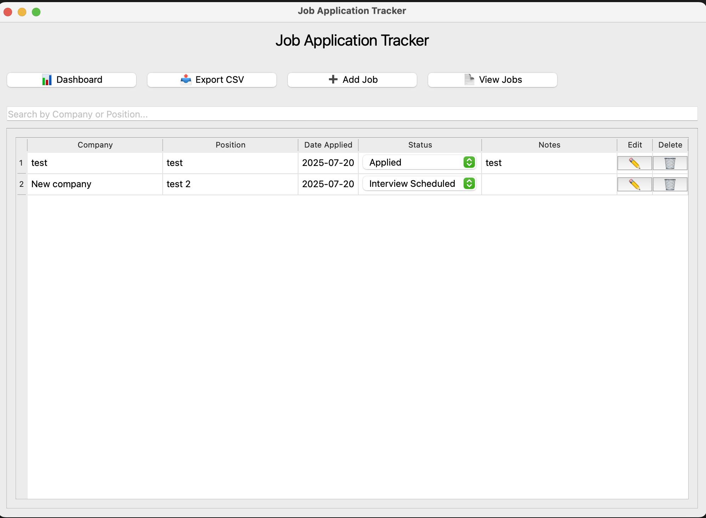

# 📋 Job Application Tracker

A simple desktop application built with Python and PySide6 to help you keep track of your job applications.

It lets you record where you've applied, attach your resume and cover letter, paste job descriptions, track status, and visualize your progress with a built-in dashboard.

---

## 🧰 Features

- ✅ Add, edit, and delete job applications  
- 🗂️ Track:
  - Company, Position, Date Applied
  - Notes and Job Description
  - Attached CV/Resume and Cover Letter
- 🔍 Search by company or job title  
- 📊 Visual dashboard with:
  - Total applications
  - Applications per status (Applied, Interviewed, etc.)
  - Interviews scheduled  
- 📎 View job descriptions and open attached files directly
- 📤 Export your job applications to CSV  
- 💾 Local SQLite database (`jobs.db`) — no setup required  

---

## 🖥️ Demo

 <!-- Add your own image or remove this -->

---

## 🚀 How to Run Locally

### 1. Clone the repo

```bash
git clone https://github.com/rash2020/job-application-tracker.git
cd job-application-tracker

```

### 2. Create and activate virtual environment (recommended)

```bash
python3 -m venv env
source env/bin/activate  # On Windows: env\Scripts\activate
```

### 3. Install dependencies

```bash
pip install -r requirements.txt
```

### 4. Run the app

```bash
python main.py
```

---

## 🛠 Tech Stack

- **Python 3.10+**  
- **PySide6** – for GUI  
- **SQLite** – local database  
- **SQLAlchemy** – ORM for database interaction  

---

## 📁 Project Structure

```bash
job-tracker/
├── assets/
│   └── screenshot.png       # App screenshot
├── data/
│   ├── database.py          # DB connection and session
│   ├── models.py            # SQLAlchemy JobApplication model
├── gui/
│   └── main_window.py       # Main GUI interface
├── utils/                   # Optional helper modules
├── migrate_db.py            # Script to migrate old DBs safely
├── requirements.txt         # Python dependencies
├── main.py                  # Entry point
├── README.md
```

---

## 📤 Export to CSV

Inside the app, use the **"Export to CSV"** option to save all job applications to a `.csv` file, which you can open in Excel, Google Sheets, or share.

---

## 📦 Packaging the App (Optional)

To create a standalone `.app` or `.exe` version :

```bash
pip install pyinstaller

pyinstaller --noconfirm --windowed --onedir --add-data "data:./data" main.py
```

This will generate a distributable app inside the `dist/` folder.

---

## 📄 License

MIT License – feel free to use, modify, and share!

---

## 👨‍💻 Author

Made with 💻 by Rashad Abbas

---